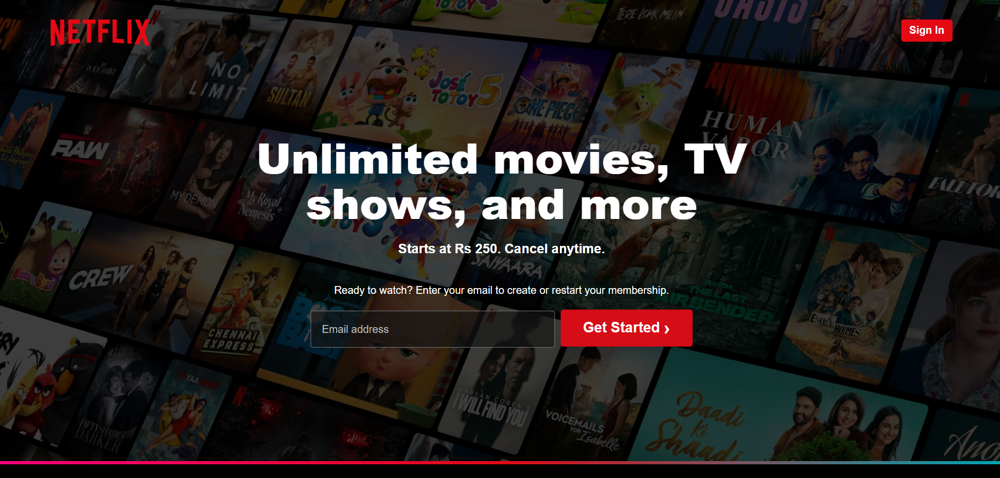

# Netflix Clone 

A responsive **Netflix Clone** built with **HTML and CSS**, inspired by Netflix's interface. This project was created as a frontend practice and portfolio project.

##  Screenshots




### Desktop


## 🚀 Features

*  Netflix-inspired user interface
*  Responsive design
*  Dark theme
*  Movie and TV show sections
*  Netflix-style hero section
*  Organized image assets
*  Built with vanilla HTML CSS and JavaScript

## 🛠️ Technologies Used

* **HTML5**
* **CSS3**
* **JavaScript ES6+**
* **Responsive Web Design**
* **Git & GitHub**

## 📁 Project Structure

```text
NETFLIX_CLONE/
│
├── Images/
│   └── Movie and UI images
│
├── screenshots/
│   ├── screenshot-desktop.png
│   ├── ON iPhone 16 Pro Max.png
│   ├── iPadPro shot.png
│   └── ... and more
│
├── index.html
├── style.css
├── script.js
└── README.md
```

## 🎯 Purpose

This project was created to practice:
* HTML structure
* CSS layouts
* Flexbox
* Responsive design
* Background images and overlays
* UI recreation
* Git and GitHub workflow

## 🌐 Live Demo

**Live Demo:**https://wasil-se.github.io/Netflix_Clone/

##  Disclaimer

This is a **frontend practice project** inspired by Netflix. It is not affiliated with or endorsed by Netflix.

##  Author

**Wasil Javed**

Built as part of my frontend web development learning journey.
                                            
                                            
                                            
                                            ===*********Thanks for visiting************===
